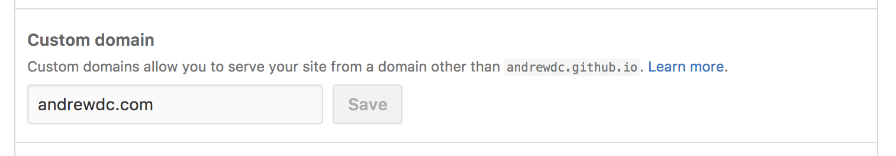

## AKA. of CNAMEs and Men

I recently switched over my site built with Gatsby and hosted via Github Pages to use my custom domain. Previously I had been publishing the output directory `public` directly to the `gh-pages` branch with the following subtree command:

`````
git subtree push --prefix public origin gh-pages
`````

Many thanks to [Guilherme Ferreira](http://gsferreira.com/archive/2014/06/update-github-pages-using-a-project-subfolder/) and some others for this trick. 

However, as I said above, I decided to pull the lever on my site and drop this new hotness into my custom domain "andrewdc.com." I added the domain via the github web ui following some instructions somewhere. 

**Don't do it this way**



The issue you will run into is that this creates a CNAME file in your `gh-pages` branch. Not a big deal until you try to run your elite subtree h4xxor command again and git barfs this error up in your base:

`````
git push using:  origin gh-pages
To github.com:andrewdc/adc.git
 ! [rejected]        5d5a6054db232f5e33e1e5840c1355859e6d8850 -> gh-pages (non-fast-forward)
error: failed to push some refs to 'git@github.com:andrewdc/adc.git'
hint: Updates were rejected because a pushed branch tip is behind its remote
hint: counterpart. Check out this branch and integrate the remote changes
hint: (e.g. 'git pull ...') before pushing again.
hint: See the 'Note about fast-forwards' in 'git push --help' for details.
`````

_ouch..._

It makes sense though, because the Github web interface is creating a file that isn't tracked by your local stuff, and is outside of your process. 

<h2 class="recent-header"><span>The Solution?</span></h2>

Simply add your own CNAME file into your output directory (mine is `/public`) and then run your subtree push. If, like me, you already totes borked your `gh-pages` branch you can wipe it out with:

`````
git push origin :gh-pages
`````

Then try `git subtree push --prefix public origin gh-pages` again.

Thanks so [Sacha Greif](https://github.com/SachaG) and of course [Kyle Mathews](https://github.com/KyleAMathews). Full [discussion here](https://github.com/gatsbyjs/gatsby/issues/6) on Github.

Hack on, Friends!

~adc
