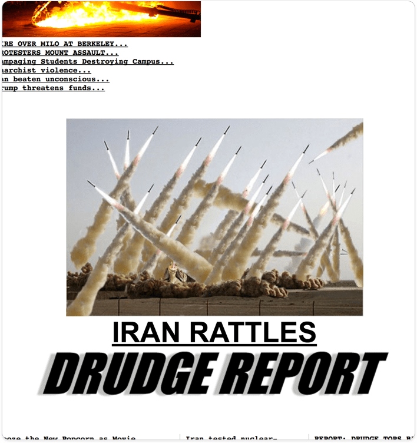

## This Some Serious OG FakeNews, Right Here

So recently this image was used in the lede by The Drudge Report, which I 'capped with a little context:

Several sites noticed, as the rather [drab](http://www.mediaite.com/online/drudge-report-uses-photo-of-jar-jar-binks-to-lead-into-story-about-iran/) and [mirthless](http://gizmodo.com/drudge-report-stokes-iran-fears-with-fake-missile-photo-1791918585) writers at Mediaite and Gizmodo did.

I don't know -- Maybe it's the dire subject, or the competition between news sites that leads to general grim writing, but it's my hope we could all just laugh at this ludicrously stupid image for a moment.

_That's why I made it_.  

## Mesa Want Mooey Mooey Contexta

One of the running themes on my ancient blog " **What The Crap?**" was awarding the most asinine things a coveted "Jar Jar Award." At the time, (July, 9 2008) Iran posted this obviously photoshopped image of a missile launch:

*Uh, Adobe's clone stamp called: "Where's my hat-tip?"*

That didn't stop loads of news sources from picking it up and running the image and story:

Considering the recent freak-out over 'fake news,' -- turns out, it's been going on since...well probably since, 'news.'  Most agencies issued corrections...[after](https://thelede.blogs.nytimes.com/2008/07/10/in-an-iranian-image-a-missile-too-many/) a bunch of average-joe dorks lambasted them on their blogs. That included this one I made, and posted to What The Crap:

*I don't know -- Seems legit.* 

Seriously though, a good laugh was had by all.

## But wait... There's More

Let's jump ahead to May 4, 2012, when Iran's Semi-Official State Mehr News Agency used this same image on their front page along side a "news" story headlined, "Iran's missile program no threat to Europe..."

*No threat missiles, you say... Are they equipped with peaceheads then?* 

This happened on May 4th - aka Star Wars Day. Was this an inside joke? 
Regardless, [The Alantic](https://www.theatlantic.com/international/archive/2012/05/busted-irans-jarring-photoshopped-missile-test-image/328453/) was right to point out that the missiles aren't the worst offense here.

*Oh, How horrid! It's the CG rabbit thing from those Star Wars parodies.*

I only wish I had a troll counter embedded in this image so I could tell how many news consumers ended up spying Jar Jar Binks in a news lede. 

At the end of the day, this is bittersweet:
 

That plus posts to HuffPo, Mediaite, Gizmodo, New Republic, The Verge, etc -- I'm going to estimate the dankness of this meme at around 50M views.

I will **never** out-troll this. 
It's my Dank Memesterpiece -- A memegnum opus -- Misa poodoo de resistance. 

I guess I can retire now. ;P

It's been real. 

-adc
