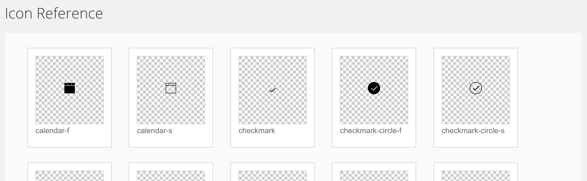
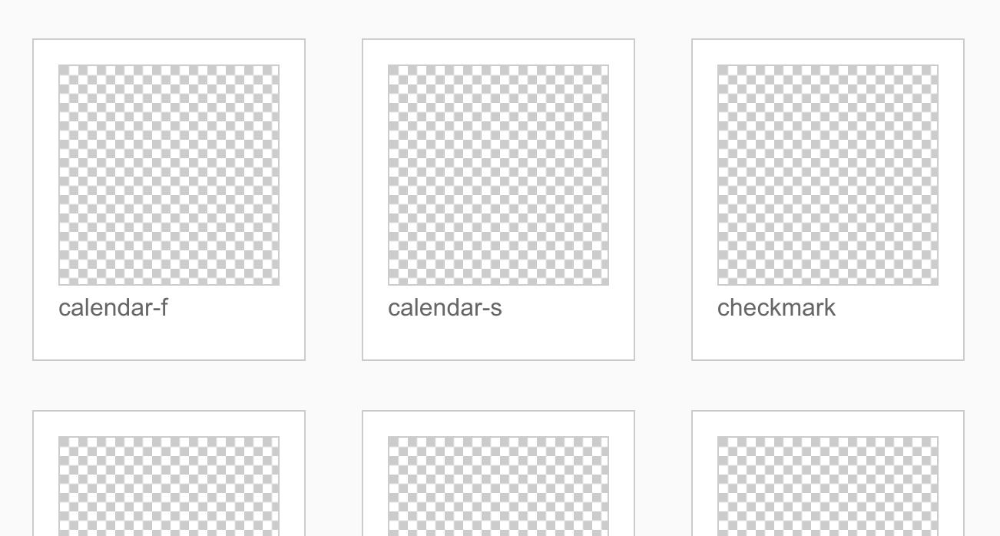
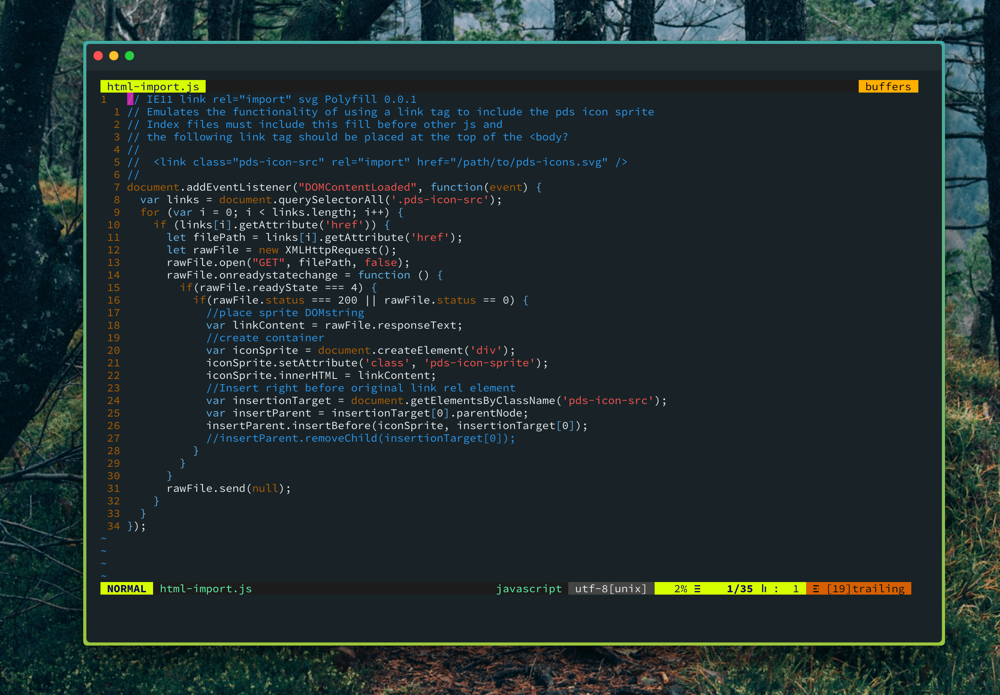

First of all, [Una Kravets wrote](https://una.im/svg-icons/#💁) an excellent piece about how to set up a coherent SVG icon approach using Gulp. I am greatly indebted to her efforts. You [should start there](https://una.im/svg-icons/#💁), then return here, if you still need to.

Also, consider our specific scenario and browser support requirements. You might be totally good to go with Una's suggestions. Mostly: **Are you routing a single-page app?**

## What we are shooting for

- Replace font based icon system with svgs (done, thx Una!)
- Maintain CSS control over icon presentation (think color, etc)
- Use the [**external** svg use](https://css-tricks.com/svg-use-with-external-reference-take-2/) method (in the end, we use both)
- Support modern browsers,  IE11 and Microsoft Edge
- NOT use [this script](https://github.com/jonathantneal/svg4everybody) polyfill script (explained why below)

## In what scenario?

- Angular 2 / Polymer Apps (part of the: 'why no polyfill.' More below.)
- A routed single-page app

Our main applications are using Angular 2 and it's Router. This appears to be a key challenge to overcome, trying to use inline or external svg sprites.

## External or Inline use?

We support IE11 (which has no support for external SVG), so we initially considered using the inline method. With it, you inject your master svg symbols sprite into the top of your html files, and reference them later by ID.

At first, this worked great. 

I used `gulp-inject` [to stuff](https://github.com/klei/gulp-inject) the optimized and grouped sprite directly after the `<body>`. Here's what the inject task looks like:
```
gulp.src('./src/index.html')
  .pipe(inject(gulp.src('icons-sprite.svg'), {
      starttag: '<!-- inject:icons-sprite.svg -->',
      transform: function (filePath, file) {
          return file.contents.toString('utf8')
      }
  }))
  .pipe(gulp.dest('./dist'));
```

The starttag stuff looks for that placeholder in my index (shown below), and I needed to stringify the svg sprite because gulp-inject doesn't directly support injecting svg files. _(I think...)_ 

```
  <body>
    <div class="icon-source">
    <!-- inject:icons-sprite.svg -->
    <!-- endinject -->
    </div>
    <main-app class="main-app"></main-app>
  </body>
```


Regardless - gulp works in it's typically straightforward conveyor-belt fashion, and just makes the sausage...


Later, one of my teammates informed me that we could simple use the newer `<link>` tag, and that we were already polyfilling this functionality. This is must simpler, it's almost criminal:

```
<!-- This requires the webcomponents-lite polyfill, but it's totally worth it -->
<link rel="import" href="/path/to/sprite.svg" />
```
You have to be joking right? That...just works? Yep. Peace out `gulp-inject`. 

Regardless of how we inject - Later, in our application we could simply do this:

```
<svg class="icon-settings-s">
  <use xlink:href="#settings-s"></use>
</svg>
```


Now way... Is that...is that actually WORKING?!!1!

**...Opens up Microsoft Edge...**


Yeah, nope. Also, for whatever reason, Firefox had to be a big hater and just not work either.

Here's what you get in Edge and FireFail with the inline SVG approach:


***Ah, the latest super minimal design. Niceeee...***

## Y U NO WORK?

As far as we could discover, the relative inline SVG problem seemed to revolve around using a routed Angular/SP application. We did discover that if you started at the index of the site _AND_ you also used the svg (literally put the image in the page and reference the sprite on the index), then the icons would persist as you navigated to any other area of the application.

Not helpful.

That's obviously no good because icons need to work everywhere, all the time. If I reload a view, or link directly to an area off the root - Icons should work.

This leads to the next logical question:

## Y U NO script???

Jonathan Neal has written a great backwards compatibility script called [_SVG for Everybody_](https://github.com/jonathantneal/svg4everybody). For most people, this probably will work well.

If I'm not mistaken, `svg4everybody` basically looks for an SVG `<use>` that references an external file, and polyfills that bit with the actual svg code.

However, since we are building routed single-page Angular applications, we would need to call this script any time there was a router change, and potentially even on any DOM update. Also, this script would need to sniff out the user agent, etc. 

This isn't the direction we wanted to go.

Alternatively, we could try and discover how to solve the SPA routing issue. We did investigate this, and found a **mountainous heap of bupkis**. 

At this point, we do not understand exactly why the relative svg's don't work. Our best guess is that MS Edge and Firefox are somehow confused on the location of the source sprite by the router/router-outlet stuff.

Or something.

_Note: just try writing your own. I needed to, as you will see later._

## What happens if you use both at the same time?

One of the brilliant devs on our team, who somehow just pops in and solves all our problems, suggested, "Can we just use both and stack them?"


Well, slow down. I don't know actually. To the science. 

Here are the various cases we tested:

`````
//================= Inline only =================
<svg>
  <use xlink:href="#settings-s"></use>
</svg>

//================= External only =================
<svg>
  <use xlink:href="./icons/icons.svg#settings-s"></use>
</svg>

//=============== Both =================
<svg>
  <use xlink:href="#settings-f"></use>
  <use xlink:href="./icons/icons.svg#settings-s"></use>
</svg>

//================= Which one wins and does source order matter?
<svg>
  <use xlink:href="./icons/icons.svg#settings-s"></use>
  <use xlink:href="#settings-f"></use>
</svg>
`````
Note: In the Both test, We used different icons so we could tell which was rendering.

In Chrome, which doesn't appear to care what crap code you write - this happens:


In other browsers, whichever mode they support (inline or external), would work. Firefox, which only handles external, for instance:


### Test Observations:

- Both uses works and doesn't break in all our supported browsers (However, is this wise?? Unknown.)
- Source order appears to be totally irrelevant
- In a street fight: Inline SVG content will always win

## Solution: Use Both...I guess?

Like I said, I have a feeling this might not be the right way to use SVG `<use>`. I don't know actually. Also, it still requires bloating your main index file with the inline svg sprite symbols. 

I do know that it works, and it doesn't require a polyfill script running anytime the application DOM state changes. 

The syntax isn't wonderful, but we will probably create a polymer component that streamlines usage. Something like:

```
<icon settings-s></icon>

// which would result in

<svg class="settings-s">
  <use xlink:href="./icons/icons.svg#settings-s"></use>
  <use xlink:href="#settings-s"></use>
</svg>

```

At a later date, we can deprecate the inline approach globally via the component, as browser support changes.

## A Polymer Component Appears

Speaking of polymer, we ran into some trouble here as well. (What a surprise, right?) Basically, because polymer components inject things as shadowy DOM, the browser doesn't exactly know when certain DOM exists (at least with SVG use tags). Perhaps it's better just to show you the component code, then explain with comments:

_Note: our system is called PowerSchool Design System, thus the PDS namespace_
```
import {PdsWidget} from './PdsWidget';
let xlinkns = 'http://www.w3.org/1999/xlink'; 
//this was needed to be valid, but was annoying to have below

export class PdsIcon extends PdsWidget {
  is = 'pds-icon';
  name: string; //We are going to use a name="" attribute to set the class and icon ID
  querySelectorAll: Function;

  properties = {
    name: {
      type: String,
      observer: '_nameObserver'
    }
  };
  messageKeysUpdated(): void {

  }
  _nameObserver(): void {
    let elements = this.querySelectorAll('use');
     //each svg tag has two use children for internal and external
    if (elements != null && elements.length === 2) {
      elements[0].setAttributeNS(xlinkns, 'xlink:href', '#' + this.name);
      elements[1].setAttributeNS(xlinkns, 'xlink:href', powerSchoolDesignSystemToolkit.svgSpritePath + '#' + this.name); 
      //We set the external path to be easily changed in any application
    }
  }
}
```
And here is what the polymer template looks like:
```
<template>
  <svg class$="pds-icon-[[name]]">
    <use xlink:href=""></use> 
    <use xlink:href=""></use>
  </svg>
</template>
```
Essentially, the problem seemed to be that we needed to set all of the use bits with JS, rather than directly with Polymer `[[name]]` (as it would hide this DOM from the browsers).

I don't really know. It was nuts. But hey, we got it working. Now we have the best of both worlds, and we can very easily update/depricate the internal approach as the tech evolves.

I'd love to hear anyone else's thoughts on this, though. Drop me a line on [Twitter @wtc](http://twitter.com/wtc). 

## Update: A new challenger appears!

Many of our applications use a build tool (e.g. gulp, webpack) to inject the svg sprite into the html, where the `<link rel="import" ..etc.. >` method isn't supported. This is quicker for the client as it require no external loading or extra request. However, some of the applications we support do not use a build tool that we support, so we needed a runtime polyfill. For reasons still unknown to me, [webcomponents-lite](https://github.com/webcomponents/webcomponentsjs) was just not working. 

So, since we didn't want to introduce any new dependency, I wrote our own with plain JS. It's a bit hacky and specific, (which is why I'm just posting an image), but it does the job:



This script looks for the link tag(s), collects the sprite path from the href attribute, then downloads and shoves the sprite file contents into a div.

Now, this might not be ideal - as it makes a synchronous blocking request on the main thread. Oddly, in our specific case, we actually don't want any of our other stuff to run before the sprite is in place, so it works for now. I will be back if we update this. 

Hack on, my friends!

-Adc
