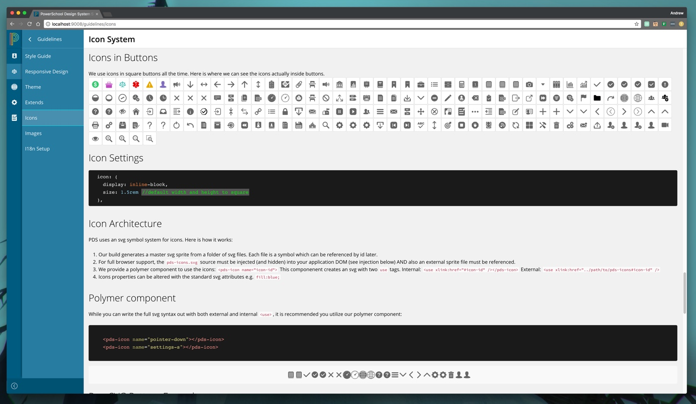

In 2005, I graduated with a degree in multimedia design from the University of Oregon. I was trained in traditional design, but I always had a deep interesting in web development. Over the years, I have spent the bulk of my career working between the two disciplines. I like to say: 

>"I design with code."

I am heavily involved in front-end development and architecture, and have a lot of experience working with modern Javascript frameworks such as Angular, and React. 

I am also a huge proponent of modular (or component) design architectures, which I have written about, and given talks. I have worked to help direct several organizations in constructing design systems based on these principals. 

Here is [my resume](https://docs.google.com/document/d/1PfFxQgbXlFGRd_xbFDfXSMPG8BSVwuSlZfKVpsGmPkw/edit?usp=sharing), and my work history is also available on [LinkedIn](https://www.linkedin.com/in/andrewdc).

<h2 class="recent-header">Design Systems</h2>

### PowerSchool Design System

A pattern and component library being built from the ground up.

I was tapped, along with two other developers to build a company-wide design system for PowerSchool. It is a component library built with Sass, Angular 2, and Polymer, and consumed by several applications. 

The system utilizes a flexible theme system, where we can provide the base design for the organization, but also allow each team the flexibility to customize and extend the library to fit their application's unique needs. 
