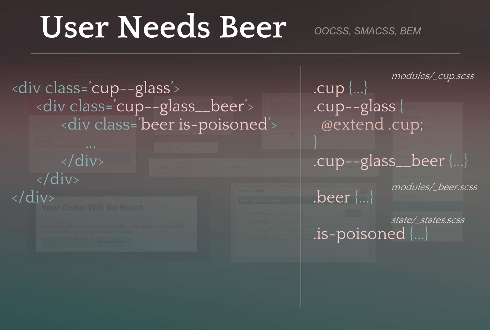
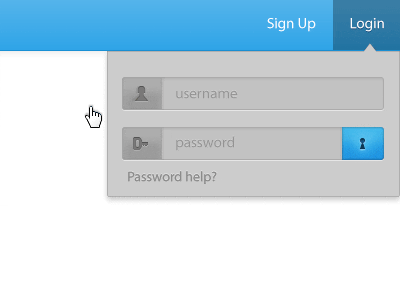
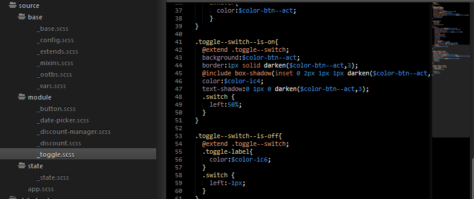

## A style-guide for modular Sass Development using SMACSS and BEM

First of all — for the non-readers, here is the pattern. Take it. Care for it.


_An OO mind-melding of SMACSS and BEM using Sass. (wut?)_

**Second** — you must read: “[How to Scale and Maintain Legacy CSS with Sass and SMACSS](http://webuild.envato.com/blog/how-to-scale-and-maintain-legacy-css-with-sass-and-smacss/)” by [Ben Smithett](http://bensmithett.com/). A lot of what I am about to write is directly inspired by his work to integrate OO ideas with SMACSS and BEM using Sass. And it’s not like I whipped all of this together myself (psssha — as if). I have a great team of front-end folks who have helped make this possible.
**Also**, you will need to understand [SMACSS](http://smacss.com/) (Scalable and Modular Architecture for CSS) and [B.E.M.](http://bem.info/) (Block — Element — Modifier), or this post will mostly be DOA. From here on, I am assuming you are familiar with the above.

But trust me, it’s worth it!

## The Why: Solving User Problems Once

If you are like me, a designer/dev, you are constantly attempting to solve user problems. Many times you might feel like you are solving the same problem again…and again.
  * A user needs to log in…
  * An account admin needs to create a discount…
  * A Star Wars fan wishes to [erase Jar-Jar Binks](http://dribbble.com/shots/811164-Jar-Jar-slight-weapons-malfunction) from existence…

At some point, you may hit upon an ideal UI/UX approach for handling one of these scenarios.


_Mistype your password again! I dare you, I double dare you…_

Sweet story bro. Now, let’s suppose that you want to extend this idea across your organization and suite of apps so that the general experience is the same each time this scenario is addressed.

"I want my solution to this user problem to be re-usable, independent, and adaptable to different use cases."

Every time a user needs to log into anything, I want a similar experience. Most of all, **I don’t want to fully re-design my solution, or worry about it conflicting with other CSS rules across my apps and organization.**

## One Pattern to Rule them All
Let’s break down an Object based solution to **User Needs Beer**. Note — _all example style codez here are in_ [SCSS](http://sass-lang.com/).

### Modules
I begin by creating the modules I need in their default, basic state.
**Beer** needs some definition:

```scss
// module/_beer.scss
.beer {
  color:amber;
  display:liquid;
  alcohol:5.2%;
}
```

I guess we could just have a huge lake of beer and have the user lap it up like a friggin’ dog. However, that seems like an undignified UX, at best. Beer can be delivered in all sorts of receptacles. I have heard there are [lakes of whiskey](http://www.youtube.com/watch?v=tYGCpGzFWh0); Perhaps lakes of beer will become commonplace at some point.

Regardless, we want beer to exist and be delivered in various forms — but **beer’s properties should not depend on its presentation method.** Thus the separation of objects into self-contained modules.

Let’s create a **cup**, and give it some general properties:

```scss
// module/_cup.scss
.cup {
  border-radius:100%;
}
```

### Modifications

Well that’s nice, but let’s not just hand the user any cup. For instance, my son drinks from a sippy-cup which has a straw. (I know what you are thinking…don’t try it. Bad form.) We need a more specific cup for this solution.

We want a cup which is also a **glass**.
```scss
// module/_cup.scss
  
.cup {
 border-radius:100%;
}
.cup--glass {
 @extend .cup;
 border-color:transparent;
 opacity:0.5;
}
```

Note that I used the double-dash notation to modify cup, and then extended my base object. If you know how `@extend` works with Sass, [and you should](http://awardwinningfjords.com/2010/07/27/sass-extend-introduction.html), this is where Sass wins big. This is using a single-class approach, as opposed to the chained [multi-class method](http://nicolasgallagher.com/about-html-semantics-front-end-architecture/) (.cup.glass). Either way works, but in my world, the single-class approach keeps things more specific. (Update — jk, I now use a double-class approach for module states, though not for modifications. See states section for more on this pattern.)
Warning: Never `@extend` outside of a module. This will break the independence of this module by causing it to require another.

Note the straightforward logic to our naming conventions here. Consider the corresponding HTML:
```html
<div class="cup--glass">
  ...
</div>
```
If you are digging through HTML templates — is it any mystery what SCSS controls this object or where you might find it? Nope.

Layout — or the lack thereof
Next — we need to pour our **beer** object into our **cup—glass** object.
Here’s where I depart from the standard SMACSS paradigm, as did [Ben Smithett](http://webuild.envato.com/blog/how-to-scale-and-maintain-legacy-css-with-sass-and-smacss/). I’ll quote:
Modules often “lay out” their child components in the same way that major components are laid out on the page.

Even if we’re 100% certain a component will never be reused, there is no benefit in treating it any differently to reusable components.

Preach it, brotha’. Beer is an object with properties. Our cup—glass is an object with properties. Beer’s layout should be determined by its context: In cup—glass. Layout rules are then handled with a parent__child module relationship — as the parent is instructing the child how to display.
```scss
// module/_cup.scss
 
.cup {
 border-radius:100%;
}
.cup--glass {
 @extend .cup;
 border-color:transparent;
 opacity:0.5;
}
.cup--glass__beer {
  height:1pint;
  head:3px;
}
```

What we have here is the cup—glass object describing the layout of beer when beer is a sub-module inside cup—glass. Beer itself doesn't determine its own layout and remains independent.
If we wish later to create a keg, and put beer inside; the keg will tell beer how it should be displayed.
This does add an extra layer of HTML — but in my experience, the gains thus far are well worth it.
```html
<div class="cup--glass">
  <div class="cup--glass__beer">
    <div class="beer">
     ...[Tricerahops](http://beeradvocate.com/beer/profile/14400/37966)... 
    </div> 
  </div>
</div>
```
Update April, 17, 2014: A lot of people may (rightly) balk at this extra HTML layer. I think that doing this can totally work as well:

```html
<div class="cup--glass__beer beer">
```

You can use the wrapped approach in the cases where you have some extra bits that need to be laid out with this module, like a header or label. To be honest, over time I use this extra html or class chain much less. 

I still am certain to separate the layout styling, from the object styling.
Either way, it should be painfully obvious what is going on here, and where the SCSS rules are located which govern the objects above.

### States

The final component of SMACSS is the concept of states.
```scss
// state/_state.scss
.is-poisoned {
  font-family:'Comic Sans', sans-serif;
  font-size:72px;
  color:puse;
}
```

States are written in readable and descriptive language beginning with .is- like: is-in-ur-base
```html
<div class="beer is-poisoned">
  ...
</div> 
```

The states in the `_states.scss` file should apply globally. For instance, beer may be poisoned, as may be food, or a poisonous-potion-of-poisoning.
UPDATED (Feb, 6 2014) Module specific states can be handled with two approaches. My old approach — I used to meld the modify and state nomenclature, but remain inside the module:

```scss
// module/_beer.scss
.beer {
 color:amber;
 display:liquid;
 alcohol:5.2;
}
.beer--ipa {
  ...
}
// states
.beer--is-brewing {
  ...  
}
```

I used the above approach for a while because I wish to maintain an organized and logical structure to my code (smacss). Also, I really loath this kind of thing:
```html
<nav class="nav navbar navbar-fixed navbar-inverse">
<!-- seriously wut? I don't even... -->
```

So… my current approach is using a double-class model (My goal is to avoid more than two classes on an object) for module specific states. To minimize collisions and confusion I always make use of CSS’s AND selector so that the object state selector is scoped to the object only.

```scss
// states
.beer.is-brewing {
  ...
}
```
Typically the object state is related enough to the object that I would know to look in the object file (`_beer.scss`) if I need to alter the state styles. If I can’t find it there — then the only other place it should be is in the global `_states.scss`. Organization, and collision protection Boom.

Great. Now I’m thirsty.

### To Module, or Not To Module

It’s important not to over-think or “over-modulize” everything. Every piece of markup you create doesn't need to be broken down into modules with parent__child wrappers. So here’s my general rule:
Break something into a module only if it would be useful in another context. Everything else remains an element or component inside a module.
You will no-doubt define your own internal guideline for this. The exception is that most apps will have several modules that are entirely app specific and really don’t lend well to re-use.


_Here’s whatever I happen to have up at the moment_

Discount and discount-manager are not really modules that another app can use. Button, date-picker, and toggle, however, are great candidates.
Make sense? I didn't cover the base files, but again, that strategery is covered pretty well by [the article](http://webuild.envato.com/blog/how-to-scale-and-maintain-legacy-css-with-sass-and-smacss/) you should have also read.
For my next trick, I shall package up these objects/modules using Bower so that I can easily pull them into any project, and document them in a company-wide design system. But not in this post because: Tooooo Loooooong.

I hope this gives you something to think about. In the end, it’s all just a naming convention inside a file organization strategy. But wow, way to crap boringness all over that cool stuff we just talked about. Let’s go back to the beer analogy.

This whole idea is still evolving in my own mind and practice, but where I once had a mish-mash of thoughts, I now have a logical and consistent approach to my front-end design and dev. And if a dev or another designer needs to work with my code — it’s no longer a naked unarmored quest through the dark forest of CSS.
Now raise your cup—glass to new adventures in front-end!

#### Bonus HTML pattern Sublime Snippet:

If you want to get started with this pattern, here’s a Sublime snippet to help get the ball rolling:
```html
<snippet>
 <content><![CDATA[
 <div class="${1:parent-module}__${2:this-module}">
  <div class="$2">
   ${3:...}
  </div> <!-- end $2 -->
 </div>]]></content>
 <tabTrigger>module</tabTrigger>
 <description>New UI Module and context wrapper</description>
</snippet>
```

_Fun fact: The Hubble Deep Field image (from this post header) — That was my uncle, [Robert Williams](http://hubblesite.org/newscenter/archive/releases/1996/01/image/a/)’ project._
