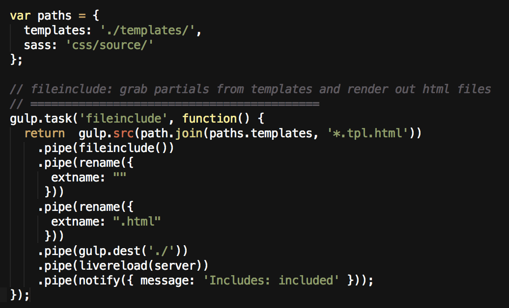
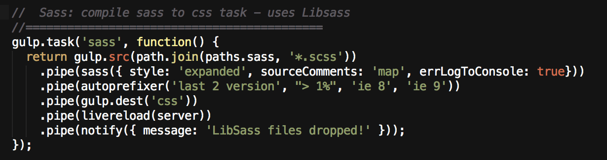
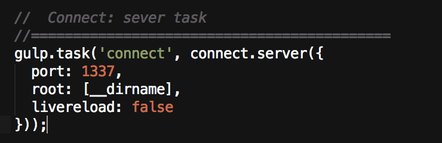
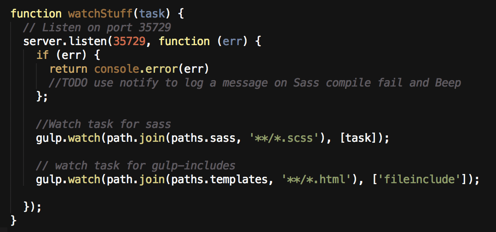
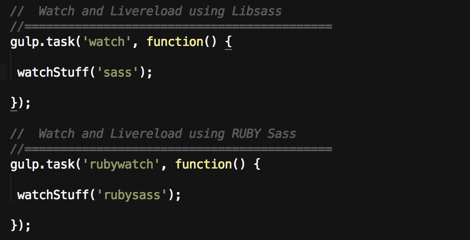
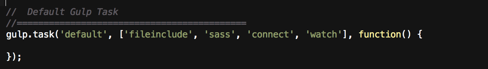

We have been using Gulp.js on a new project at work, and I’m now using it to power and build my own projects. I’m writing this article to help even non-technical people (I am a designer by schooling) understand Gulp. We are going to build a static site tool because I think the best way to learn is to build something useful.

## Why a static site tool?

I tend to like static site generators because they are excellent for rapid prototyping, and I have been using them for my own website because I like that level of control. If you are like me, you may tend to get frustrated trying to reengineer or refit someone else's system into your own. Also, I really don’t like meddling with an intermediary abstraction layer or admin interface (typical in a CMS like Wordpress), and I don’t need a database or other features many solutions provide.

"My ideal admin interface is the code itself."

With that said, I don’t want to return to 1996 either. I want to leverage the power of my favorite stuff like Sass, Jade, or Markdown. Previously, I have used great tools like Middleman, StaticMatic, nanoc, and lately my current site was built with Ruhoh. Let me say right-away that there is nothing at all wrong with any of these tools. In fact, I strongly recommend considering them yourself. However, as I have wrapped my head around Gulp, I believe it may be the best fit for my needs, doing exactly what I need, and not a lot more.

## Learn by building

Since this will already be a bit long, I’m not going to get into setting up Gulp in this post. There are many excellent introductions out there already. I can say, you will need Node, Gulp, and probably Ruby. (However, If you do run into trouble getting this going, please bug me about it. I’d love to help!). Instead, I am going focus on using Gulp to setup a static site “framework.”

"Get excited: My current gulpfile is only 110 lines long."

…that includes comments.

Now, before we get too far, it is important to understand one more thing about Gulp:

## One plugin for one job

Similar to Grunt, Gulp has a collection of plugins which each serve a single focused purpose. These plugins can be piped together in a gulp task to do a more complicated job. I think you will find (as I did) that this approach is incredibly straightforward, and you need not fully comprehend the technicality of node.js streams (fascinating though…) before you can start using gulp.
Let’s build a tiny static site tool
Here’s the checklist of what we want:

  * Templates and partials
  * Sass
  * A preview server for development
  * An automated Watch that uses Livereload

Our goal is to create a single gulp task that can do all of this at once. However, we need to create a task for each specific job first.

## Templates and partials

As I said, Gulp tasks can be collections of plugins, but you can think of them like simple recipes. The first recipe a static site tool needs is a way to include partial html files into other template files. Ain’t no way in the ‘verse I’m repeating myself with things like nav, header, footer, etc. My recipe for this looks like:
  * Get my template file out of this bin
  * Include some partial files
  * Rename it
  * Drop the new file into this other bin
  * Tell my browser to refresh
  * Notify me that this job was completed

Got that? Now see if you can map that concept to the real code which executes these jobs in exactly that order:



If you aren’t familiar with this type of code, here’s the longer explanation.
The core plugin for this job is gulp-file-include. It grabs files and plops them wherever you place an `@@include`. In my index.tpl.html file I have stuff like:
```html
<header>
 <h1 class="nx-header"> Style Guidelines and Examples</h1>
 </header>
 
 @@include('./templates/_nav.html')
 <main>
 @@include('./templates/_type.html')
 @@include('./templates/_layout.html')
...etc...
```

## Where are the files

Now, first I recommend establishing your paths (telling gulp where the files are) outside of your tasks so you can easily modify your file structure.
```js
var paths = {
 templates: ‘./templates/’,
 sass: ‘css/source/’
};
```

I follow a simple naming convention for template files to keep me from confusing them with generated output files. Any file that has a .tpl in it maps directly to an output file with the same name, minus the .tpl. If I want an index.html file, then the template for it is in /templates/ and it is named index.tpl.html.
Partial files follow the standard naming convention using an underscore like `_nav.html.`

## Naming the task

```js
gulp.task('fileinclude', function() {
```

This first line names the task “fileinclude” so I can call this recipe later when I want it to execute. You can name a task whatever you want: e.g. coverMePorkins. 
However, I name tasks based on what core job they do, and in this case it happens to be the name of the core gulp plugin I intend to use.

## Getting the files

```js
return gulp.src(path.join(paths.templates, '*.tpl.html'))
```

This line establishes where the file is that you want gulp to get. In this case I want all files in /templates/ that end with *.tpl.html. path.join() simply connects the first part (directory) with the second part (file-name). If you were wondering why I use path.join instead of the simple javascript: paths.templates + ‘*.tpl.html’, here is a great explanation. (Props to my js hacker friend Cameron for that.)

## Running gulp-file-include
```js 
 .pipe(fileinclude())
 ```

At the beginning of a gulpfile we have instructions on which plugins to use. Typically we store a plugin like gulp-file-include in an object simply called fileinclude. Therefore, this line of code asks the core gulp-file-include plugin to run and insert any partials in my template file.

## Renaming the template
```js
.pipe(rename({
 extname: ""
 }))
 .pipe(rename({
 extname: ".html"
 }))
```

Huge shout-out to my design partner in crime Lauren for this bit. This uses a plugin called gulp-rename to strip off the .tpl from index.tpl.html. The first rename replaces the .html extension with nothing, then the second replaces the new extension (now .tpl) with .html. So now we have a file just called index.html with my html chunks inserted into it.

## Where do you want this new file?
```js
.pipe(gulp.dest('./'))
```

This places the generated and renamed file index.html into the root of my project. (As a site gets more complicated — you may want generated files to be placed someplace totally different like /dist.)

## Hey browser! Something happened!
```js
.pipe(livereload(server))
```

This uses gulp-livereload to tell my browser (which is running the Livereload extension) something changed and it should refresh now that the output file has been saved.

## “We have clearance, Clarence.”
```js
.pipe(notify({ message: 'Includes: included' }));
```

This uses gulp-notify to inform me (This uses OSX’s notification center. If you are on a windows system you can use gulp-notify-growl.) that everything went down successfully.
That task is complete.

## Compile Sass into CSS

Now that I have explained the fileinclude task, a task for compiling Sass should look pretty familiar:


_Different, but the same_

This uses a different collection of gulp plugins, but works in exactly the same manner. The core plugin for compiling Sass is gulp-sass (which uses Libsass), and you may note we pass it a couple of formatting options (e.g. style: ‘expanded’). The plugin gulp-autoprefixer totally pwns browser prefixing so I don’t have to worry about that in my Sass files. The task outputs into my /css directory, tells the browser to reload, and again, messages me that it worked.

## A simple server for previewing

We definitely want a quick way to look at what we are building. For this I use a server plugin called gulp-connect:


_Port 1337…really? What kind of dorky nerd…oh yeah. We are talking about programming. nm._

This task is simply called connect, and it will serve up whatever files you target from your project to http://localhost:1337. Of course you can serve your stuff to whatever port number you choose. I can’t totally remember, but I think I disabled livereload for this task because I was having trouble getting it to work the way I wanted — and I ended up calling it in my watch task later. Speaking of…

## A watch task

Where normal tasks run on command and stop when finished, the point of a watch task is to run constantly, watching for changes to certain files (e.g. Saving a Sass file) and then kick off other tasks, such as the ones we have already created. Having a solid watch task can greatly increase the efficiency of your workflow. Why waste time manually running tasks or reloading your browser when you can automate?
My watch task has two parts, because I prefer to use Libsass, but certain features of Sass 3.3.4 are not fully implemented. In my project I have another task called rubysass which uses Ruby to compile. At this point I want to be able to use either as needed. This is a great demonstration of the power of Gulp since you can write straight Javascript. Rather than have two nearly identical watch tasks, I create a function and pass it which Sass compile task to use:


_I can pass in different tasks to this watch function. One uses Ruby Sass, one uses Libsass._

```js
function watchStuff(task) {
First I name the function and give it a way to pass in the Sass compile task I want.
Livereload
 server.listen(35729, function (err) {
  if (err) {
   return console.error(err) 
  };
```

Then server refers to a node plugin for live reload called tiny-lr. We tell server what port to listen on (35729 is the Livereload default) and allow for errors to be reported to the console.

Watch what? Do what?
```js
 //Watch task for sass
 gulp.watch(path.join(paths.sass, '**/*.scss'), [task]);
```

A gulp.watch typically works like:
  * What do you want me to watch?
  * What do you want me to do when I see something happen?

First I watch my Sass directory for any changes to files that end with .scss. When detected — we run the [task] that is passed into the function (Libsass or Ruby Sass).
```js
 // watch task for gulp-file-include
 gulp.watch(path.join(paths.templates, '**/*.html'), ['fileinclude']);
```

The second watch listens for changes to files in my templates directory, and runs the fileinclude task we wrote at the beginning when it detects a change.
Note that I am not doing anything in my watch function but running other tasks. In the spirit of one tool for one job, I like to keep my functions and tasks fairly focused.

Lastly, we need to create two other tasks that tell my watchStuff function which Sass compile task I want my to use.


_My default task is Libsass because I would like to use it as soon as it is updated. My alternate uses Ruby Sass._

The first task, just called watch runs the watchStuff function and passes in the Sass task we wrote above. The rubywatch runs another similar task (I haven’t shown here) that simply uses a different Sass compiler.

## Do all the things

All of these tasks are great, but as I said in the beginning, we really don’t want to have to run each of them separately every time we want something done. Let’s create a master task to kick off our other tasks for us.


_Default to the most common and most useful collection of tasks._

It is always a good idea to have a default gulp task. This is the task which runs by simply entering gulp without any taskname. I set my most commonly used tasks as my default. Therefore, I start by running the fileinclude task first to make sure the latest html changes are rendered. Next I do the same with my Sass files. After that I start up my preview server at http://localhost:1337 with connect. Finally I kick off my default watch which will start Livereload and continue to automatically run my fileinclude and sass tasks.

My alternate task is nearly identical but is called useruby and runs my rubywatch instead. Since it isn’t the default, it is run with:
```bash
gulp useruby
```
Any tasks we have created can be run in this fashion. For example, If you simply need a one time Sass compile you could run:
```bash
gulp sass
```

And with that, we have basically all the things that I use on a day to day basis to build stuff quickly and efficiently.

## We are just getting started

As you might have guessed, there are many more things that Gulp can do. (I mentioned Jade before, and you can easily write a task to wrangle jade files) I’m certainly no expert, so this has been a fun learning experience for me as well. As a tool, I am continually adding and refactoring my gulpfile (feel free to view/steal what I currently have in this gist. ) to do more things. At some point I intend to create a tiny vanilla package out of this tool that can help me and others quickly get a site up and running.

I can say I have been impressed with how simply I (designer, remember…) can get Gulp to do what I want. The code is not obscure or arcane and I love that I can easily write tasks to do exactly the jobs I need.

I think it is worth your time to give it a shot. If you run into problems, or have ideas and suggestions, drop me a line. I would love to hear other people’s experiences using Gulp.

-adc
