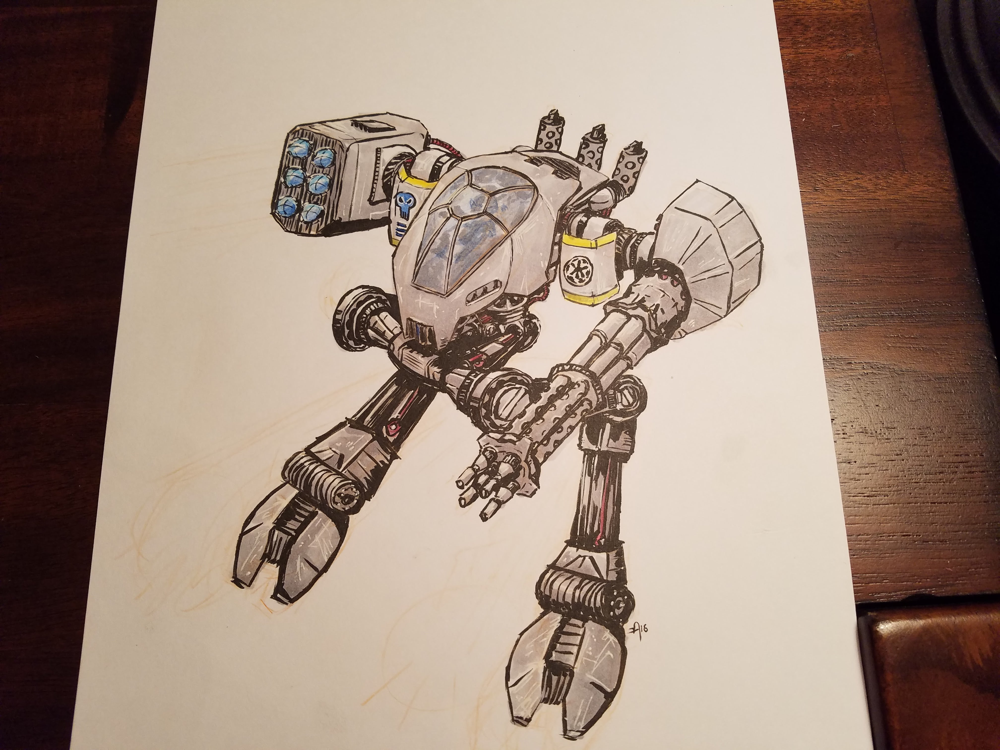
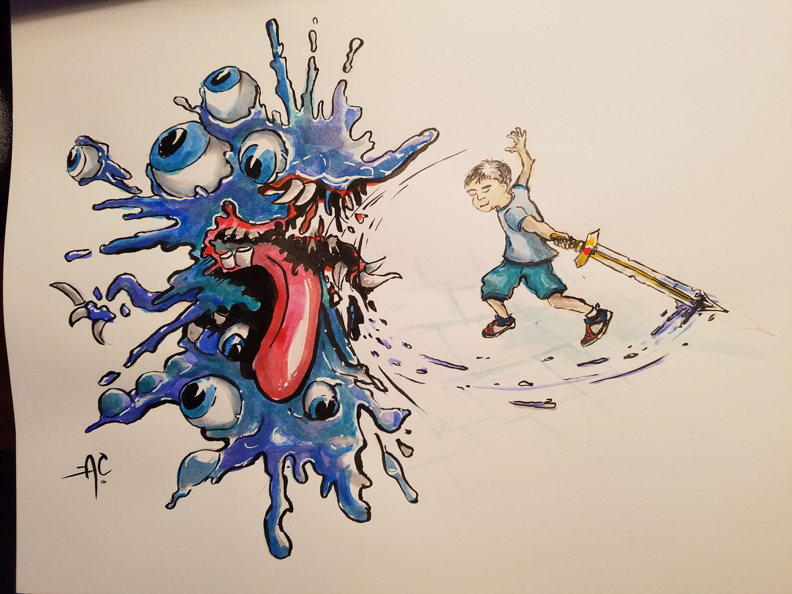
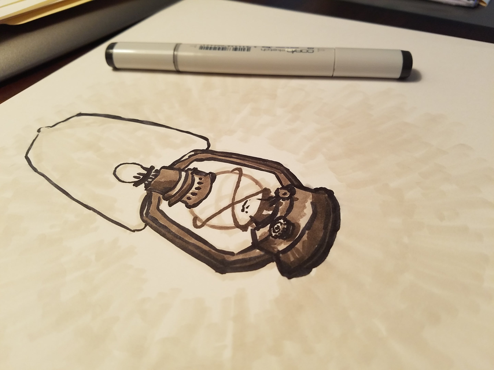
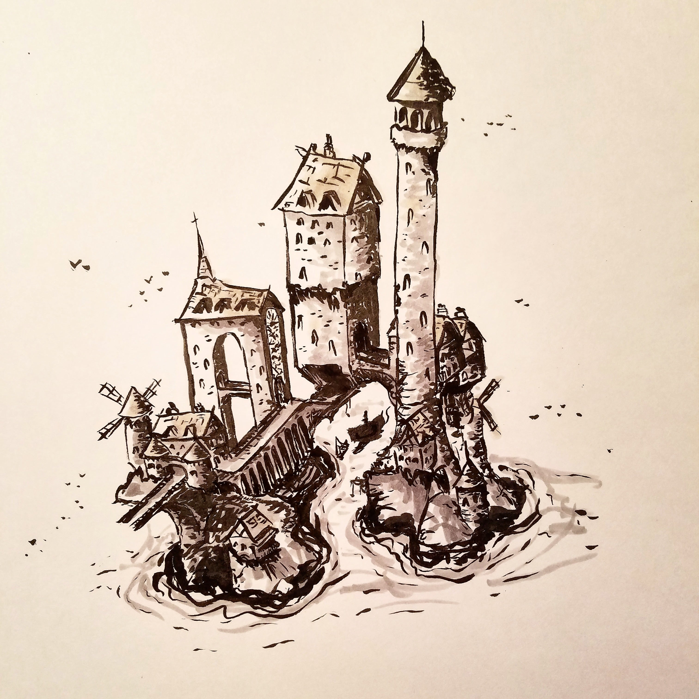
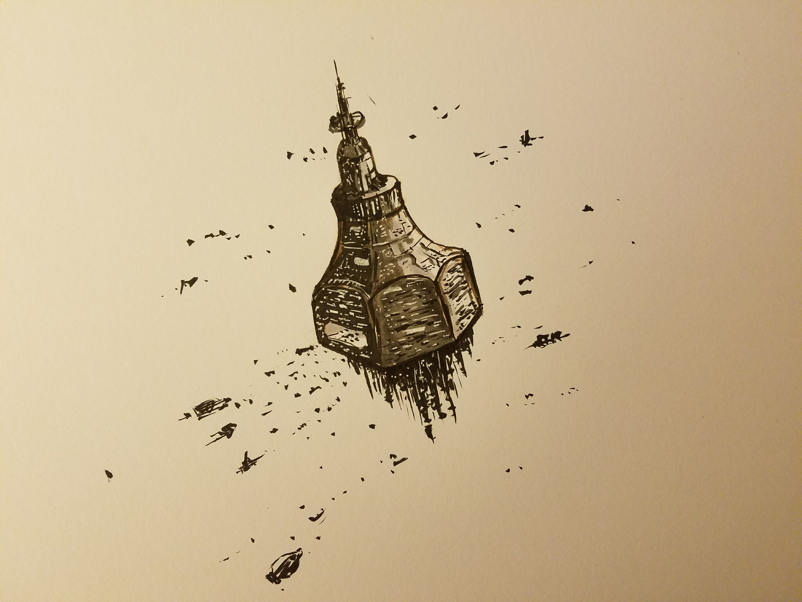
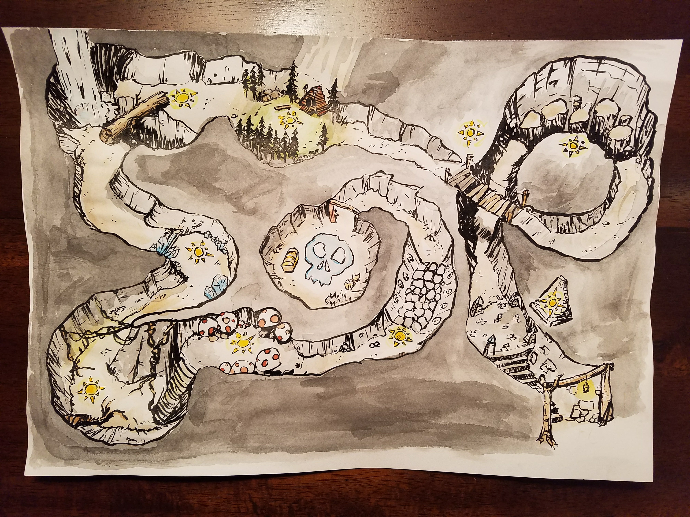
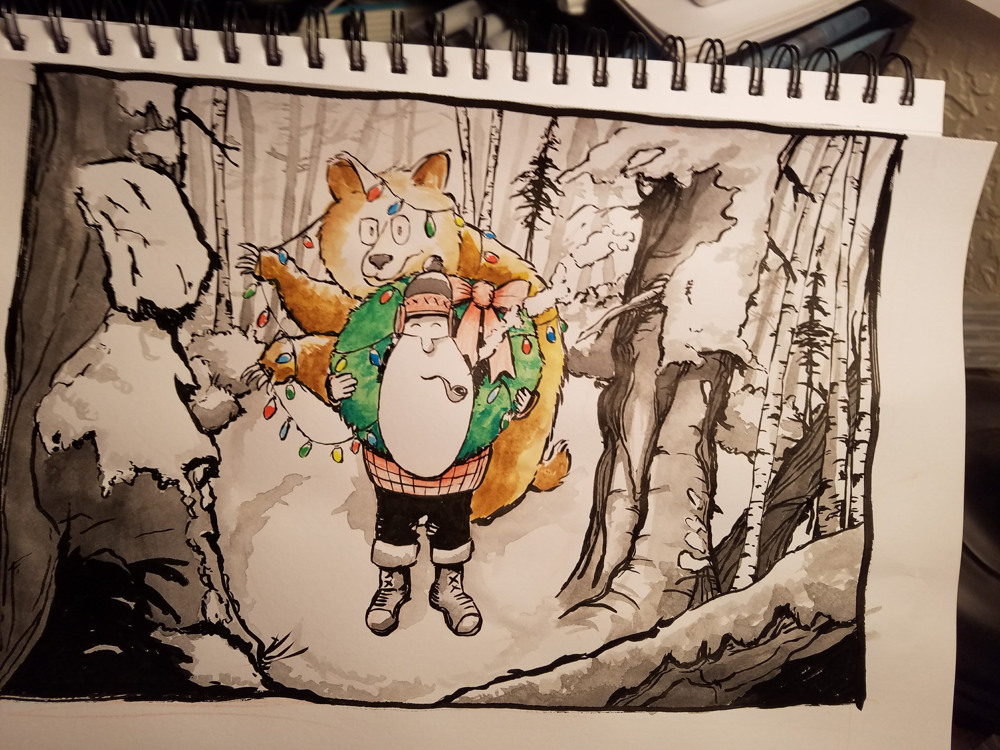
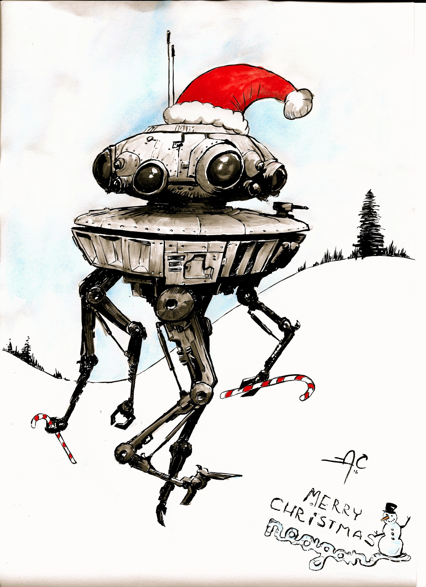
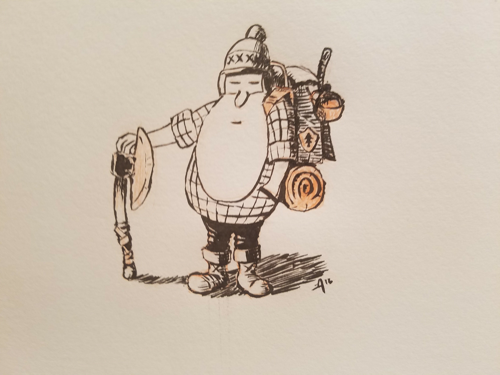
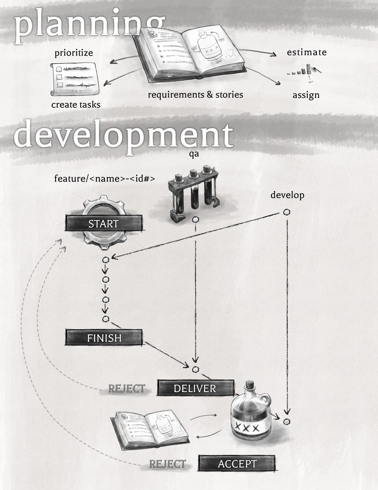

My live outlet for my illustration work is through Instagram: [@bullet_and_whiskey](https://www.instagram.com/bullet_and_whiskey/). Feel free to drop by and say hello! Here are a few highlights:

  
  
  
  
  
  
  
  
  
  
  
  
  
  
  
  

## [Lonely Lenny from Inktober 2016](./len/)

My goal for Inktober 2016 was to create or develop a character every day. In the end, I came up with [Lonely Lenny](./len/) and kept him running.

## Team Process

One of the teams I worked with at Incomm Digital Solutions came up with an agile process that worked well for us. I created this graphic to represent what that looked like:

This illustration accompanied an article I wrote [on Medium](https://medium.com/@wtc/one-agile-process-to-bring-them-all-61eab4e7a982#.lvmvszdr3).

***

### A Word of Gratitude

Drawing has always been something near and dear to my heart. However, though I studied traditional drawing and panting a great deal in college, I took about a ten year sabbatical from illustration. 

For some time I was convinced that digital illustration was the path for me. My day job is working with code and screens though (which I _love_, don't get me wrong), and I've recently found a renewed enjoyment in creating illustrations with traditional mediums such as ink and watercolor. 

I owe a debt of thanks to the great community of artists on Instagram for inspiring me to get back into drawing and painting. Here are a few talented folks (in no particular order) who have encouraged me along the way:

- Laurence Dabbs [@lcdabbs1979](https://www.instagram.com/lcdabbs1979/)
- Gaia Bordicchia [@gaiabordicchia_illustration](https://www.instagram.com/gaiabordicchia_illustration/)
- Michael Mastermaker [@warpzonegraphics](https://www.instagram.com/warpzonegraphics/)
- Nikki Frumkin [@drawntohighplaces](https://www.instagram.com/drawntohighplaces/)
- Bodie Hartley [@bodieh](https://www.instagram.com/bodieh/)
- August 'Illustrated' [augustillustrated.com](http://www.augustillustrated.com/) - [@augustillustrated](https://www.instagram.com/augustillustrated/)
- Sara Snyder [@surreal.appeal](https://www.instagram.com/surreal.appeal/)
- Mike Brisk [briskstudios.com](http://www.briskstudios.com/)
- Jake ??? [@jacobblackart](https://www.instagram.com/jacobblackart/)
- Justin Mezzell [justinmezzell.com](http://justinmezzell.com/)
- Jake Parker [mrjakeparker.com/](http://mrjakeparker.com/)
- ullikummi [@ullikummi](https://www.instagram.com/ullikummi/)
- Matthew S. Armstrong [matthewart.com](http://www.matthewart.com/) - [@matthew.s.armstrong](https://www.instagram.com/matthew.s.armstrong/)
- Jessica Chung [@prettyprintsandpaper](https://www.instagram.com/prettyprintsandpaper/)
- Michael Lindberg [@dustybrockway](https://www.instagram.com/dustybrockway/)
- Kyle Corson [kylecorson.com](http://kylecorson.com/) - [kyrality](https://www.instagram.com/kyrality/)
- Rogie King [rog.ie](http://rog.ie) - [@rogie](https://www.instagram.com/rogie/)
- Elyse Holladay [elyseholladay](https://www.instagram.com/elyseholladay/)
- Johnny Bobgan [@drawntosketching](https://www.instagram.com/drawntosketching/)
- Jared Kohn [jaredkohn.com](http://jaredkohn.com) - [@mountain_lines](https://www.instagram.com/mountain_lines/)
